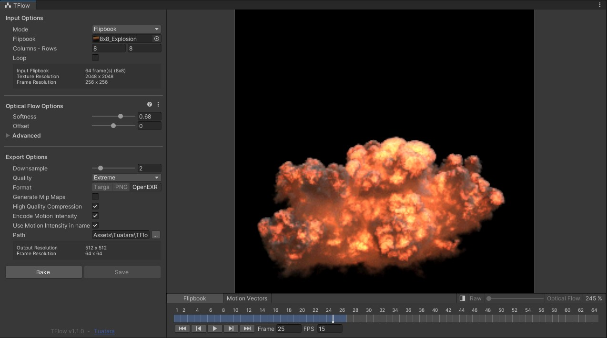
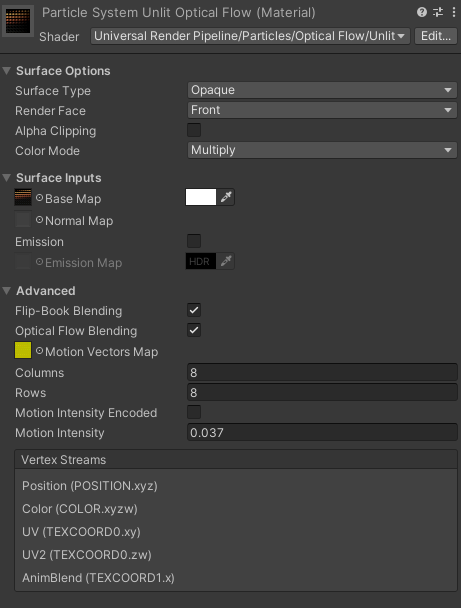
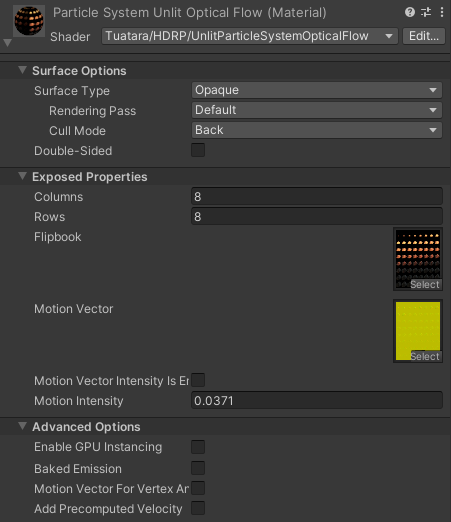
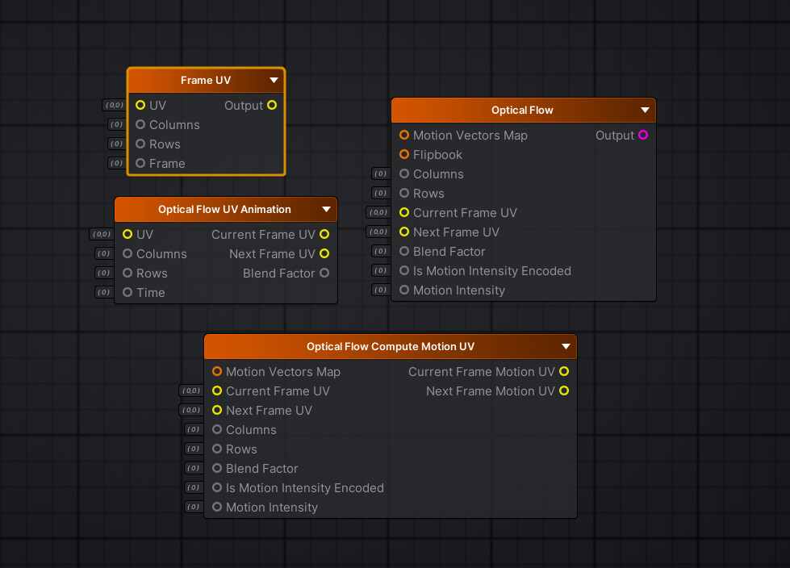
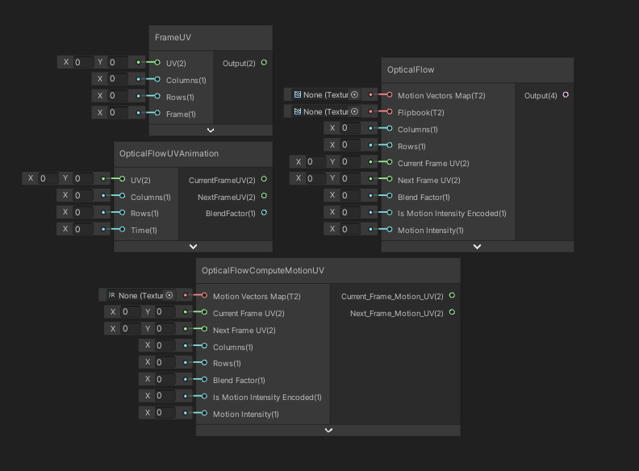
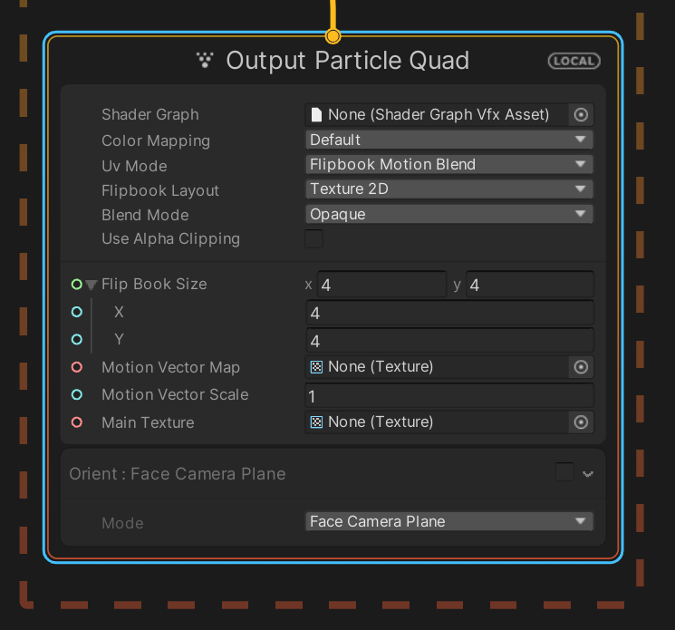
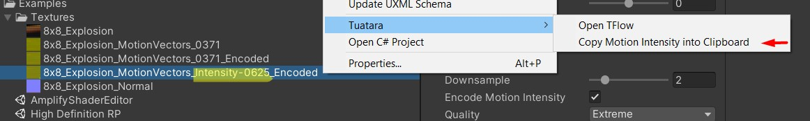
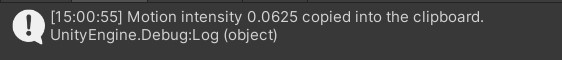
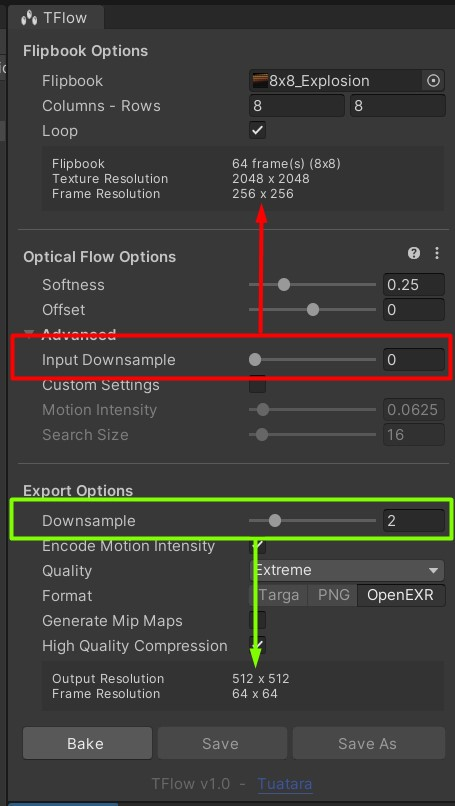
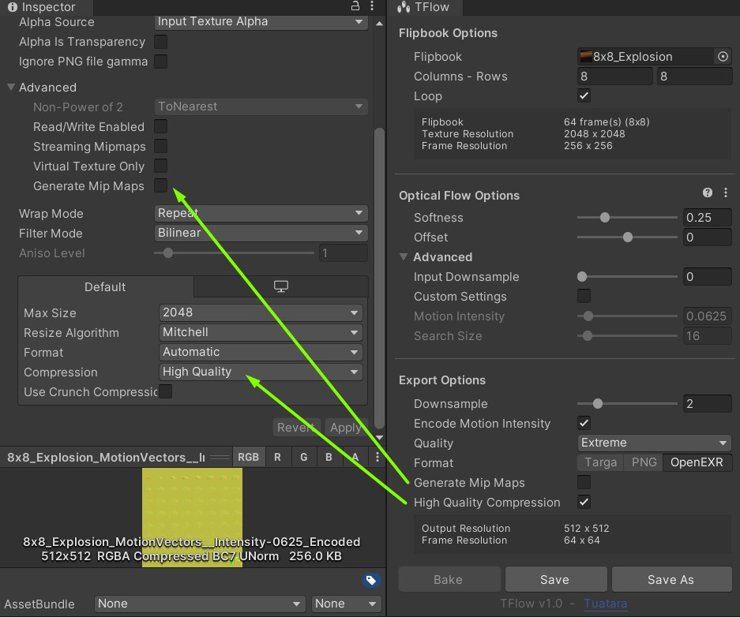

TFlow is a motion vector generator that helps increase the utility and quality of your flipbooks. With provided shader examples it adapts to many rendering pipelines.

# How does it work?

1. Use our baking tool to generate motion vectors for your flipbook.
2. Use the motion vectors texture and the flipbook at runtime to get optical flow blending.

# Get TFlow

- [Unity Asset Store](https://u3d.as/2F5t)
- UE Marketplace - 🔜 Coming Soon

# What's inside

- An editor baking tool for Unity that generates motion vectors textures.

  

- Shaders, nodes and material examples to use optical flow blending in your projects.

# Support

TFlow baking tool works on any Windows platform/pipeline.

| Application                 | Baking tool support |
|-------                      |-------|
| Windows Unity 2019.4 LTS    |  ✅  |
| Windows Unity 2020.3 LTS    |  ✅  |
| Windows Unity 2021.1        |  ✅  |
| Windows Unity 2021.2b       |  ✅  |
| Unreal Engine       |  🔜 Coming Soon  |

A set of shader functions is available to use on any Unity or pipeline version. Using these functions you'll be able to support optical flow in your own shaders.
We also provide integration examples for Universal RP, High Definition RP, Shader Graph and Amplify Shader Editor.

| Pipeline            | Shaders support |
|-------              |-------|
| Unity Universal RP 10+       |  ✅ |
| Unity High Definition RP 10+      |  ✅  |
| Unity Amplify Shader Editor       |  ✅  |
| Unity VFX Graph     |  ✅ |
| Unity Shader Graph  |  ✅ |
| Unity Custom Shaders  |  ✅ |
| Other or older Unity pipelines | ✅ but without examples (see **Getting Started > Shader Functions)**  | 
| Unreal Engine       |  🔜 Coming Soon  |

> 👉 If you need support for a specific Unity or pipeline version, feel free to contact us.

# Getting started

  
<strong>Unity Installation</strong>

- Download TFlow package for Unity. See [Get TFlow](#get-tflow).
- Import the package in your Unity project

<strong>Baking</strong>

- Open the tool `Window > Tuatara > TFlow` or right click on your flipbook `Tuatara > Open TFlow`.
- Drop your flipbook in the texture field and fill in the size
- Check *Loop* if your sequence is supposed to loop

> 💡 The column and row count will be filled automatically if the size is included in the file name like "*COLUMSxROWS*".

- Press *Bake* and *Save As*.

For more details, check the [Advanced](#advanced) chapter.

  
<strong>Universal RP</strong>

Extract **Universal RP** package located in `TFlow/Runtime/Examples` folder.
Open **Universal RP** scene located in `TFlow/Runtime/Examples/Universal RP` folder.

**1. Particle System Shaders**
 
We have added optical flow behaviors in our own version of Unity Universal RP particle shaders. You can use them in your materials by selecting one of these:

    Universal Render Pipeline/Particles/Optical Flow/Lit
    Universal Render Pipeline/Particles/Optical Flow/Simple Lit
    Universal Render Pipeline/Particles/Optical Flow/Unlit

To enable optical flow behaviors, you must enable **Flip-Book Blending** and **Optical Flow Blending** and fill the properties correctly.

 1. **Motion Vector** - The texture computed using TFlow baker.
 2. **Columns and Rows** - The related frame count of your flipbook.
 3. **Motion Intensity Encoded** - Did you encode the intensity in the Motion Vector texture ?
 4. **Motion Intensity** - If the value is not encoded in the texture then use the value contained in the texture file name (Ex: *8x8_Explosion_MotionVectors_Intensity-0371* fill **0.0371**). You can also get the value in the clipboard by right clicking on the texture (see **Motion Intensity** section).

  
**2. Example Shader**
  
We provide a shader example made with **Shader Graph** to illustrate the usage of the custom nodes. This shader can be selected in `Tuatara/OpticalFlow`.
For more detailed explanation of shader creation with optical flow behaviors using **Shader Graph**, see **Shader Graph** section.

**3. Shader Functions**
  
We provide a set of functions that you can use in custom shaders or in any node base shader authoring tool.
For more informations about those functions, see **Shader Functions** section.

**4. VFX Graph**
  
We provide a VFX Graph example. By using the VFX Graph without any custom shader, optical flow works out of the box with **Uv Mode** set to **Flipbook Motion Blend**.
For more informations about these functions, see **VFX Graph** section. 

  
<strong>High Definition RP</strong>

  
Extract **High Definition RP** package located in `TFlow/Runtime/Examples` folder.
Open **High Definition RP** scene located in `TFlow/Runtime/Examples/High Definition RP` folder.

**1. Particle System Shader**
 
We provide an unlit particle system compatible shader, it can be selected in `Tuatara/HDRP/UnlitParticleSystemOpticalFlow`.
Here are the properties associated with the optical flow behaviors.

 1. **Columns and Rows** - The related frame count of your flipbook.
 2. **Motion Vector Intensity Is Encoded** - Did you encode the intensity in the Motion Vector texture ?
 3. **Motion Intensity** - If the value is not encoded in the texture then use the value contained in the texture file name (Ex: *8x8_Explosion_MotionVectors_Intensity-0371* fill **0.0371**). You can also get the value in the clipboard by right clicking on the texture (see **Motion Intensity** section).
  

**2. Example Shader**
  
We provide a shader example made with **Shader Graph** to illustrate the usage of the custom nodes. This shader can be selected in `Tuatara/HDRP/UnlitOpticalFlow`.
For more detailed explanation of shader creation with optical flow behaviors using **Shader Graph**, see **Shader Graph** section.

**3. Shader Functions**
  
We provide a set of functions that you can use in custom shaders or in any node base shader authoring tool.
For more informations about those functions, see **Shader Functions** section.

**4. VFX Graph**
  
We provide a VFX Graph example. By using the VFX Graph without any custom shader, optical flow works out of the box with **Uv Mode** set to **Flipbook Motion Blend**.
For more informations about those functions, see **VFX Graph** section.

  
<strong>Amplify Shader Editor</strong>

  
Extract **AmplifyShaderEditor** package located in `TFlow/Runtime/Examples` folder.
Open **AmplifyShaderEditor** scene located in `TFlow/Runtime/Examples/AmplifyShaderEditor` folder.

You will find a shader example and several shader functions. These shader functions have several pruposes.
  
- **Frame UV** - Outputs a frame subUV based on flipbook properties (columns and rows) and current frame. This can be used to drive a flipbook based animation.
- **Optical Flow UV Animation** - Outputs current frame subUV, next frame subUV and a blending factor between current and next frame. This can be used to drive a flipbook based animation with frame blending.
- **Optical Flow Compute Motion UV** - Outputs current frame subUV and next frame subUV with taking motion vector and flipbook properties into account.
**Optical Flow** - Outputs optical flow blending result of the current and next frames from flipbook and its properties.

  
  
The example shader uses two functions to compute optical flow blending.

- **Optical Flow UV Animation** : Computes the subUV and a blending factor based on the current time in the flipbook animation.
- **Optical Flow** : Applies motion vector values onto the previously computed subUV and blends the two current and next frames using the blending factor. 

  
<strong>Shader Graph</strong>

  
The **Shader Graph** examples provided in the **High Definition RP** and **Universal RP** packages are using several Sub Graphs to compute optical flow blending. Those Sub Graphs are located in the `TFlow/Runtime/Examples/Shader Graph`.

- **Frame UV** - Outputs a frame subUV based on flipbook properties (columns and rows) and current frame. This can be used to drive a flipbook based animation.
- **Optical Flow UV Animation** - Outputs current frame subUV, next frame subUV and a blending factor between current and next frame. This can be used to drive a flipbook based animation with frame blending.
- **Optical Flow Compute Motion UV** - Outputs current frame subUV and next frame subUV with taking motion vector and flipbook properties into account.
**Optical Flow** - Outputs optical flow blending result of the current and next frames from flipbook and its properties.

    
  
The example shaders mainly use these two functions to compute optical flow blending.

- **Optical Flow UV Animation** : Computes the subUV and a blending factor based on the current time in the flipbook animation.
- **Optical Flow** : applies motion vectors values onto the previously computed subUV and blend the two current and next frames using the blending factor. 

  
<strong>Shader Functions</strong>

  
This is the core of the package. With these function, you'll be able to handle optical flow in any type of shader or pipeline.
You can find all the functions in the **OpticalFlowCommon.hlsl** file located in the `TFlow/Runtime/Shaders` folder.
- **FrameUV_float** - Outputs a frame subUV based on flipbook properties (columns and rows) and current frame. This can be used to drive a flipbook based animation.
- **OpticalFlowUVAnimation_float** - Outputs current frame subUV, next frame subUV and a blending factor between current and next frame. This can be used to drive a flipbook based animation with frame blending.
- **OpticalFlowComputeMotionUV_float** - Outputs current frame subUV and next frame subUV with taking motion vector and flipbook properties into account.

Here is some pseudo code to use these functions.

    float2 uv = texcoord0;
    float time = 14.5;
    float columns = 8;
    float rows = 8;
    
    float2 uvCurrentFrame, uvNextFrame;
    float blendFactor;
    OpticalFlowUVAnimation_float(uv, columns, rows, uvCurrentFrame, uvNextFrame, blendFactor);
    
    float4 currentMotionVectors = tex2D(motionVectorsMap, uvCurrentFrame);
    float2 nextMotionVectors = tex2D(motionVectorsMap, uvNextFrame);
    float isEncoded = 0.0;
    float intensity = 0.0371;
    
    float2 currentFrameMotionUV, nextFrameMotionUV;
    OpticalFlowComputeMotionUV_float(	uvCurrentFrame, uvNextFrame,
    					currentMotionVectors, nextMotionVectors, isEncoded, intensity,
    					columns, rows, blendFactor,
    					currentFrameMotionUV, nextFrameMotionUV);
    
    float4 currentMotionVectors = tex2D(flipbookTex, currentFrameMotionUV);
    float4 nextMotionVectors = tex2D(flipbookTex, nextFrameMotionUV);
    float4 color = lerp(currentMotionVectors, nextMotionVectors, blendFactor);

  
<strong>VFX Graph</strong>

  
We provide simple VFX Graph examples in the **High Definition RP** and **Universal RP** packages that are using default shader output nodes.
To enable optical flow blending behaviors, you need to set **Uv Mode** as **Flipbook Motion Blend** and provide the computed motion vector map. You can set the **The Motion Vector Scale** manually or get its value using the texture just like in the examples.
  
  
  

# Advanced

  
<strong>Motion intensity</strong>

  
  The motion intensity defines how the motion vector texture should influence the blending. It's needed at runtime because the Motion Vector texture is normalized and needs to be transformed before being used.
  By default, the motion intensity is in the file name and encoded in the blue and alpha channels. We only keep track of the fractional part of the intensity number (with and intensity of **0.0371** the file name would be *8x8_Explosion_MotionVectors_Intensity-**0371***).

  Storing the motion intensity in two places allows to have a motion vectors texture that can be used in any pipeline.

  If you choose to name the texture differently, you can always get the motion texture by right clicking *Tuatara > Copy Motion Intensity into clipboard*.

  
  

  
<strong>Looping flipbooks</strong>

If your flipbook animation is supposed to loop, enable the *Loop* checkbox so that the last frame blends with the first frame.
Otherwise, the last frame fades out.

  
<strong>Downsampling</strong>

- Input Downsample (red)

  Increase this value to reduce the input size before generating motion vectors. This will increase the processing speed and reduce the overall quality. 
  We recommend increasing this value only if the input size is higher than 2048x2048.

- Output Downsample (green)

  Increase this value as much as possible to get the smallest motion vectors texture and thus save runtime performance.
  Don't increase it if the blending looks worse.
  Changing this doesn't affect the processing speed.

  
<strong>Baking options</strong>

- **Softness** 

  Use a small value to detect fine detail/slow motion and a larger value for fast motion. 
  Using a larger value slows down the baking process.
  This setting is a simplification of *Search size* in *Advanced* settings. 

- **Offset**

  Play with this value if the blending doesn't look correct.
  Most of the time, there is no need to change it and you can leave it at 0.
  This setting will offset *Motion intensity* in *Advanced* settings. 
  It doesn't affect the motion vectors, only the blending.

- **Input downsample**

  See **Advanced > Downsampling**.

- **Custom settings**

  When enabled, you get full control over *Motion Intensity* and *Search Size*. These settings are not designed to be used manually.

- **Motion intensity**

  Controls the motion vectors intensity in the blending process.
  With a value of 0, you can preview what the blending looks like without motion vectors, just a regular blending.
  This setting doesn't affect the motion vectors, only the blending.

- **Search size**

  TFlow uses the *Farneback Optical Flow* algorithm to generate motion vectors and the *Search Size* is the most important setting.
  Use a small value to detect fine detail/slow motion and a larger value for fast motion. 
  Using a larger value slows down the baking process.
  It's in pixel space.

  
<strong>Export options</strong>

- **Downsample**

  See **Advanced > Downsampling** .

- **Encode Motion Intensity**

  Save the motion intensity value (from *Optical flow options > Advanced*) into the blue and alpha channels.
  This value is required at runtime for blending. See **Advanced > Motion intensity**.

- **Quality**

  Save the texture as 32bit per channel float [0, 1] or 8bit per channel [0, 255].
  Always choose Extreme quality unless you have strong size/performance constraints (such as Android platform).

- **Generate Mip Maps**

  Enable this to generate mip maps. 
  You can always change this afterwards in the texture import settings.

- **High quality compression**

  Always enable this if your platform supports it, it's non destructive compression. 
  You can always change this afterwards in the texture import settings.

# Technical support

For any question related to TFlow or for technical support.
- [Github](https://github.com/Tuatara-VFX/TFlow/issues)
- <support@tuataravfx.com>

Don't hesitate to send us feature request as well.

# Resources

- [Tuatara](https://tuataragames.com/)
- [Free VFX Image Sequences & Flipbooks](https://blog.unity.com/technology/free-vfx-image-sequences-flipbooks)

# Versions

You can access the documentation of previous versions. 
Checkout the [changelog](Changelog.md) for more details.

- [v1.1.0](https://github.com/Tuatara-VFX/TFlow/tree/v1.1.0)
- [v1.0.0](https://github.com/Tuatara-VFX/TFlow/tree/v1.0.0)
