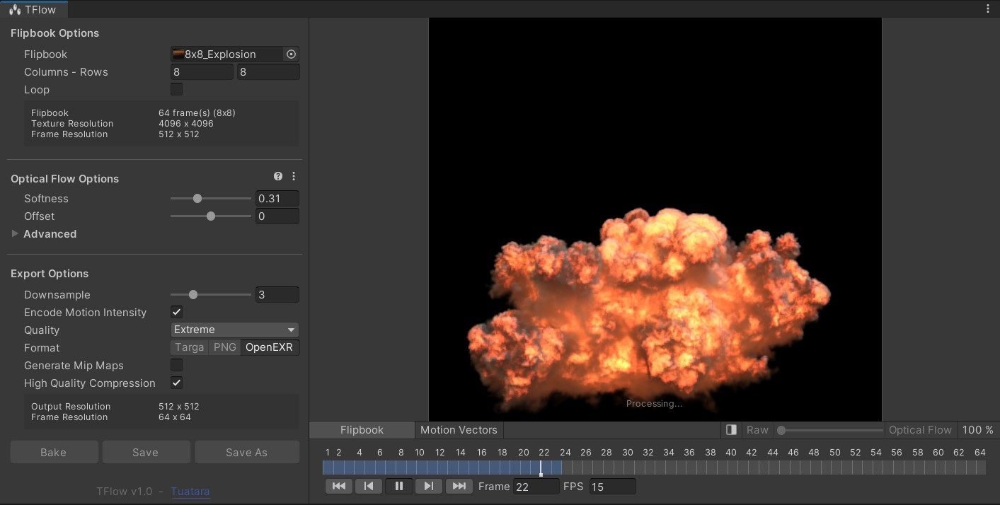
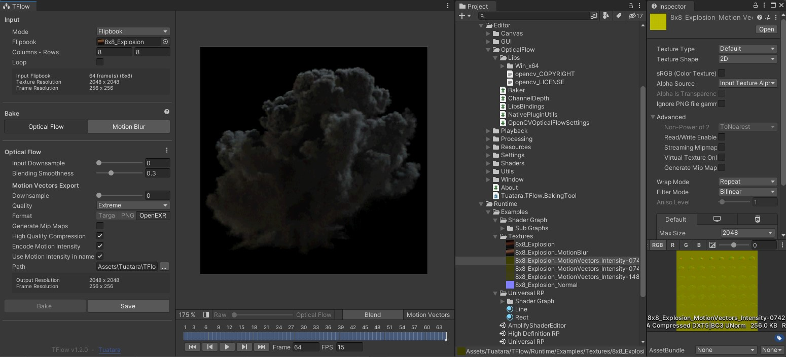
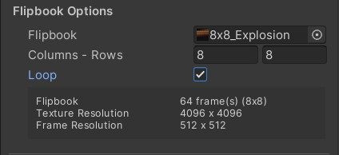
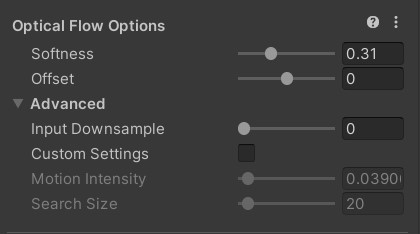

TFlow is a motion vector generator that helps increase the utility and quality of your flipbooks. With provided shader examples it adapts to many rendering pipelines.

# Get TFlow

- [Unity aset store product page](missing_link)
- Unreal Engine coming soon

# What's inside

- An editor baking tool for Unity

  

- TODO: Shaders

# Support

TFlow baking tool works on any platform/pipeline.

| Application         | Baking tool support |
|-------              |-------|
| Unity 2019.4 LTS    |  ✅  |
| Unity 2020.3 LTS    |  ✅  |
| Unity 2021.1        |  ✅  |
| Unity 2021.2b       |  ✅  |
| Unreal Engine       |  🔜 Work in progress  |

However, shaders support is not as simple as there is many pipeline versions.

> 👉 If you need support for TFlow for a specific pipeline version, please contact us through the asset store page.

| Pipeline            | Shaders support |
|-------              |-------|
| Unity URP 11+       |  ✅  |
| Unity HDRP 11+      |  ✅  |
| Unity Amplify       |  ✅  |
| Unity VFX Graph     |  ✅  (supported by default) |
| Unity Shader Graph  |  ✅  |
| Unity Custom Shaders  |  ✅  |
| Unreal Engine       |  🔜 Work in progress  |

# Getting started

  
<strong>Unity Installation</strong>

- Download TFlow package for Unity. See [Get TFlow](#get-tflow).
- Import the package in your Unity project

<strong>Baking</strong>

- Open the tool `Window > Tuatara > TFlow` or right click on your flipbook ``Tuatara > Open TFlow`.
- Drop your flipbook in and fill in the size
- Check *Loop* if your sequence is supposed to loop

> 💡 The column and row count will be filled automatically if the size is included in the file name like "*COLUMSxROWS*".

- Press *Bake* and *Save As*.

For more details, check the *Advanced* chapter.

  
<strong>URP/HDRP shaders setup</strong>

  Explain here 

  
<strong>Amplify Shaders setup</strong>

  Explain here 

  
<strong>VFX Graph setup</strong>

  Explain here 

  
<strong>Shader graph setup</strong>

  Explain here 

# Advanced

  
<strong>Looping flipbooks</strong>

  

  If your animation is supposed to loop, enable the *Loop* checkbox so that the last frame blends with the first frame.

  Otherwise, the last frame fades out.

  
<strong>Downsampling</strong>

  WIP

  
<strong>Baking options</strong>

- **Softness** 

  Use a small value do detect fine detail/slow motion and a larger value for fast motion. 
  Using a larger value slow down the baking process.
  This setting is a simplification of *Search size* in *Advanced* settings. 

- **Offset**

  Play with this value if the blending doesn't look correct.
  Most of the time, there is no need to change it and you can leave it to 0.
  This setting will offset *Motion intensity* in *Advanced* settings. 
  It doesn't affect the motion vectors but only the blending.

- **Input downsample**

  See the **Downsampling** advanced topic.

- **Custom settings**

  When enabled, you get full control over *Motion Intensity* and *Search Size*. These settings are not designed to be used manually.

- **Motion intensity**

  Controls the motion vectors intensity in the blending process.
  With a value of 0, you can preview what the blending looks like without motion vectors, just a regular blending.
  This setting doesn't affect the motion vectors but only the blending.

- **Search size**

  TFlow use the *Farneback Optical Flow* algorithm to generate motion vectors and the *Search Size* is the most important setting.
  Use a small value do detect fine detail/slow motion and a larger value for fast motion. 
  Using a larger value slow down the baking process.
  It's in pixel space.

  
<strong>Export options</strong>

  WIP

  
<strong>Motion intensity</strong>

  WIP

  
<strong>Write your own shader</strong>

  WIP

# Technical support

[Submit an issue here](https://github.com/Tuatara-VFX/TFlow/issues) to ask any question related to TFlow or to get technical support. 

Don't hesitate to send us feature request as well.

# Resources

- [Tuatara website](https://tuataragames.com/)
